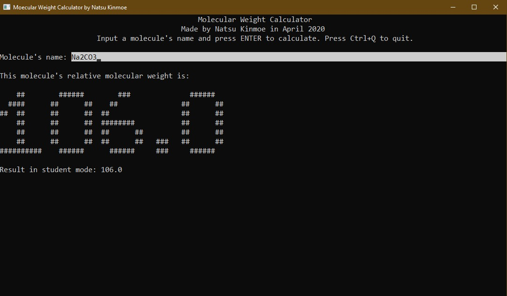

# Molecular Weight Calculator
If you are a middle school student, you must be worried about chemistry, like me. (Be quiet! Don't let my chemistry teacher hear it!)

如果你是一个中学生，你一定很担心你的化学成绩，像我一样。（小声点，别被我的化学老师听见了！）

You also must be worried about the calculation problems in the chemistry exams. The annoying chemical equation, the annoying molecular weight and the annoying format.

你一定也很担心你的试卷中的计算题。那令人头疼的化学方程式、令人头疼的相对分子质量和令人头疼的死板格式。

So this program is made to calculate the relative molecular weight, for most of the middle school students like me. I hope you will enjoy using the program.

所以为了大部分像我一样的中学生，我制作了这个计算相对分子质量的程序。希望大家使用愉快。

There are two versions you can download —— Windows version and macOS version. After downloading, please extract **all** files in the zip archive to the **same** folder.

你可以下载Windows版本或者macOS版本。下载完成后，请将压缩包中**所有**文件解压到**同一个**文件夹。

Program Shotcut:

程序运行截图：

Note: the result in student mode is **really** for students, it only contains elements occuring in the calculating problems and it ignores most of the decimal parts (except `Cl`'s is also `35.5`), like `Cu`'s relative atomic weight is `64` in student mode, but in fact, it is `63.6`.

注：其中的“Result in student mode”是为学生准备的结果，它只包含在计算题中常见的元素，并且省略了大部分的小数部分（除了氯的相对原子质量还是`35.5`），以符合各大考试卷的标准。比如，铜的相对原子质量在学生模式中是`64`，但是实际上是`63.6`。

## For programmers

The program contains an API. Before using the API, please copy the program and paste it in `path` directories (like `C:\Windows\System32` in Windows and `/usr/local/bin` in macOS) or in the same directory as your executable file.

程序包含一个API，在使用API之前，请先将本程序拷贝到一个`path`文件夹中（如Windows中的`C:\Windows\System32`和macOS中的`/usr/local/bin`），或者拷贝到和你的可执行文件相同的文件夹中。

The API includes commands below:

API包含如下命令：

`molecular-weight-calculator -a [Name]`

Calculate the relative molecular weight of `[Name]`.

计算`[Name]`的相对分子质量并输出。

`molecular-weight-calculator -at [Name]`

Calculate the relative molecular weight of `[Name]`, and multiply it by 10 (to prevent using decimal parts).

计算`[Name]`的相对分子质量，乘10并输出（以防止出现小数部分）。

`molecular-weight-calculator -s [Name]`

Calculate the relative molecular weight of `[Name]` in student mode.

在学生模式下计算`[Name]`的相对分子质量并输出。

`molecular-weight-calculator -st [Name]`

Calculate the relative molecular weight of `[Name]` in student mode, and multiply it by 10 (to prevent using decimal parts).

在学生模式下计算`[Name]`的相对分子质量，乘10并输出（以防止出现小数部分）。

